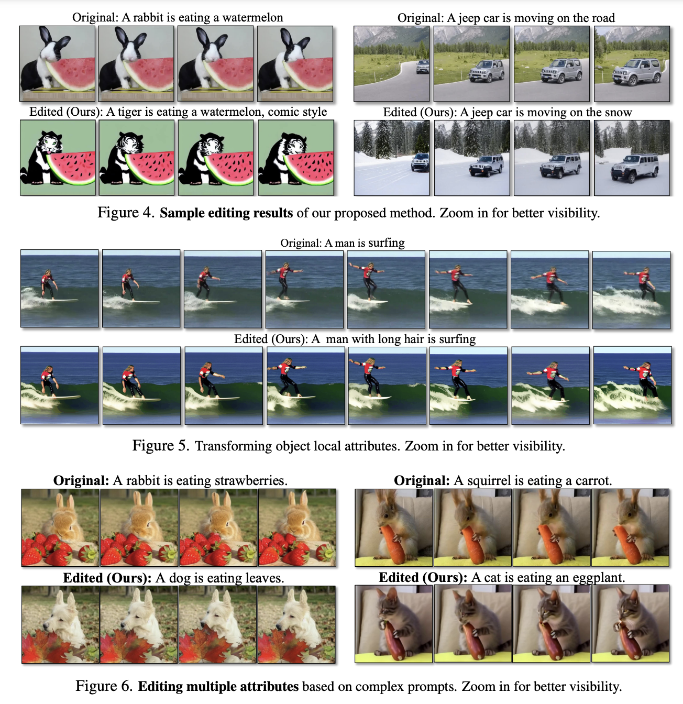
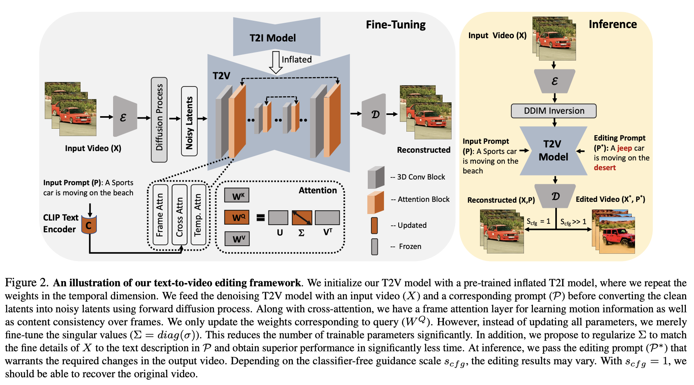
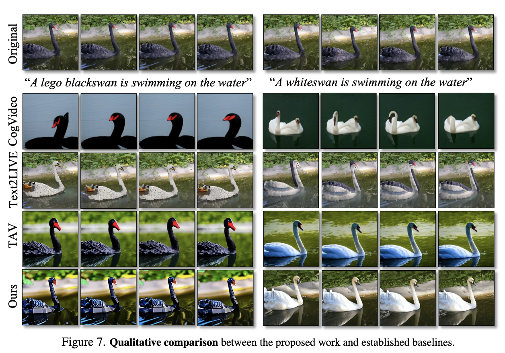
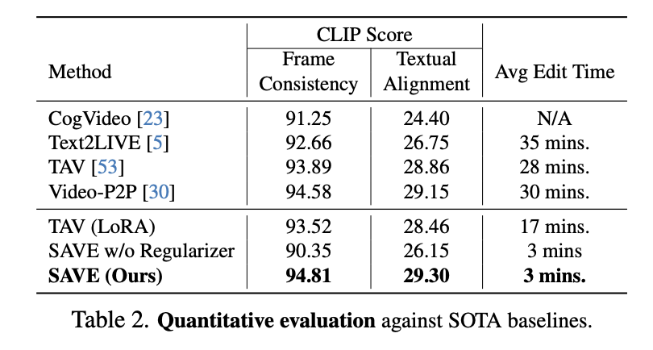

<h2 align="center"> <a href="https://github.com/umarkhalidAI/LatentEditor">Free-Editor: Zero-shot Text-driven 3D Scene Editing</a></h2>
<h5 align="center"> If you like our project, please give us a star ⭐ on GitHub for the latest update.  </h2>

<h5 align="center">

[](https://free-editor.github.io/)
[](https://arxiv.org/abs/2312.13663)
[](https://github.com/nazmul-karim170/SAVE-Text2Video-Diffusion/blob/main/LICENSE) 


</h5>

## [Project page](https://free-editor.github.io/) | [Paper](https://arxiv.org/abs/2312.13663) 




## 😮 Highlights

SAVE allows you to edit your video in a matter of **3 minutes!** instead of **30 minutes!** in SOTA. 


### 💡 Efficient, High-quality, and Fast-speed
- Stable Diffusion (SD) for image generation   -->   high-quality
- Only fine-tune the Singular Values of the Query Matrices  --> Efficient Adaptation


## 🚩 **Updates**

Welcome to **watch** 👀 this repository for the latest updates.

✅ **[2023.12.1]** : We have released our paper, Free-Editor on [arXiv](https://arxiv.org/abs/2312.13663).

✅ **[2023.12.1]** : Release [project page](https://save-textguidedvideoediting.github.io/).
- [ ] Code release.

## 🛠️ Methodology




## 🚀 3D-Editing Results

### Qualitative comparison



### Quantitative comparison



## 👍 **Acknowledgement**
This work is built on many amazing research works and open-source projects, thanks a lot to all the authors for sharing!
* [Tune-A-Video](https://github.com/showlab/Tune-A-Video)
* [Stable Diffusion](https://github.com/CompVis/stable-diffusion)
* [Diffusers](https://github.com/huggingface/diffusers)

## ✏️ Citation
If you find our paper and code useful in your research, please consider giving a star :star: and a citation :pencil:.

```BibTeX
@misc{karim2023save,
      title={SAVE: Spectral-Shift-Aware Adaptation of Image Diffusion Models for Text-driven Video Editing}, 
      author={Nazmul Karim and Umar Khalid and Mohsen Joneidi and Chen Chen and Nazanin Rahnavard},
      year={2023},
      eprint={2305.18670},
      archivePrefix={arXiv},
      primaryClass={cs.CV}
}
```
<!---->
